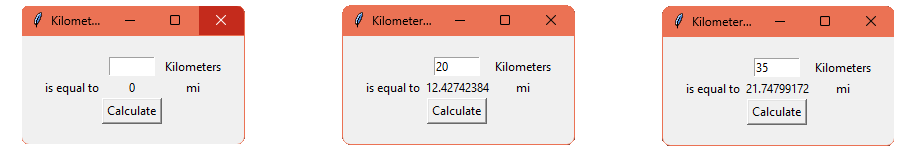

# Km to mi Converter

Program asks user for input in kilometers then converts it to miles.
## Used technologies/frameworks/libraries/languages
Python 3.11, tkinter, PyInstaller 6.11.1
## Installation
Download folder "client" and run "Km-to-mi-Converter.exe". You need to have Python installed on your machine to run this application.
## License
This project is licensed under the MIT License.
